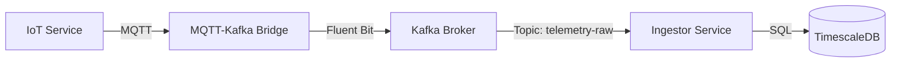

# IoT Data Flow Architecture

This document describes the data flow and interconnection between the IoT Service, the MQTT-Kafka Bridge, Kafka, and the Ingestor service.

## Data Flow Diagram



## Components Description

### 1. IoT Service (Publisher)
- **Role**: Generates and publishes telemetry data.
- **Protocol**: MQTT.
- **Target**: Sends data to the MQTT-Kafka Bridge.

### 2. MQTT-Kafka Bridge
- **Role**: Acts as an intermediary to forward MQTT messages to Kafka.
- **Technology**: Fluent Bit.
- **Function**: Listens for MQTT messages and forwards them to the configured Kafka topic.
- **Configuration**:
  - **Input**: MQTT plugin listening on port 1883.
  - **Output**: Kafka plugin producing to the `telemetry-raw` topic.

### 3. Kafka (Message Broker)
- **Role**: Decouples the ingestion layer from the processing layer.
- **Topic**: `telemetry-raw`.
- **Function**: Stores telemetry messages temporarily for consumption.

### 4. Ingestor Service (Consumer)
- **Role**: Consumes messages from Kafka and persists them.
- **Technology**: Go application.
- **Function**:
  - Subscribes to the `telemetry-raw` topic.
  - Decodes messages.
  - Stores data into the TimescaleDB database.

## IoT Connection Details

To connect the IoT Service to the system locally (running via Aspire):

- **Protocol**: MQTT (TCP)
- **Host**: `localhost`
- **Port**: The port is dynamically assigned by Aspire.
    - Check the **Aspire Dashboard** under the **Projects** project, look for the `mqtt-bridge` resource, and find the endpoint named `mqtt-port`.
    - Alternatively, check the console output for the assigned port (e.g., `localhost:55001`).
- **URL Format**: `tcp://localhost:<assigned-port>`
- **Topic**: The bridge listens for MQTT messages. The specific MQTT topic may be configured in the IoT service, and Fluent Bit will capture it (Input Tag `mqtt.data` routes to Kafka). You can typically publish to any topic if not strictly filtered, or use a default like `sensor/data`.

### Example
If Aspire assigns port `62345` to the `mqtt-bridge`:

```bash
mqtt-pub -h localhost -p 62345 -t "sensor/data" -m '{"temp": 25.5}'
```
